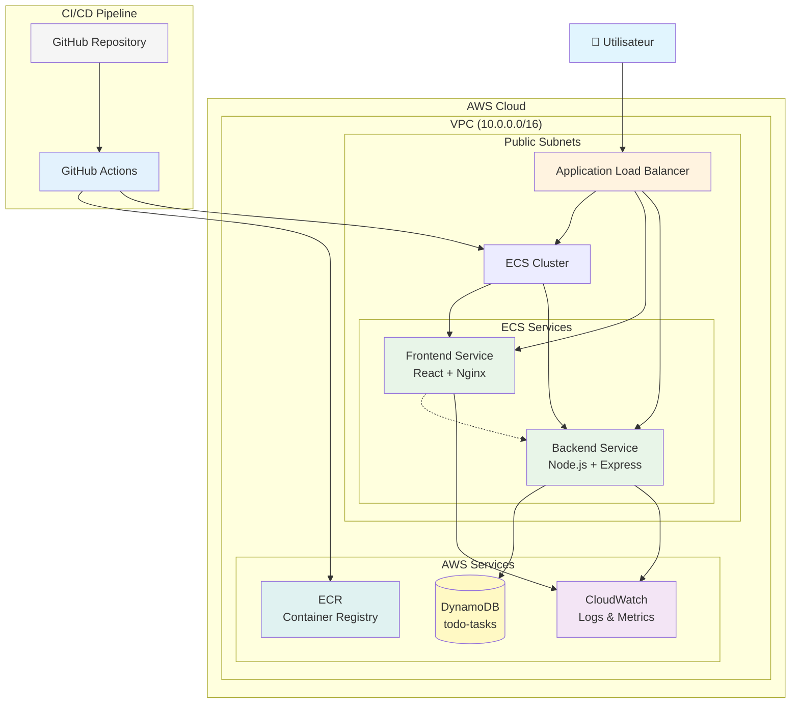
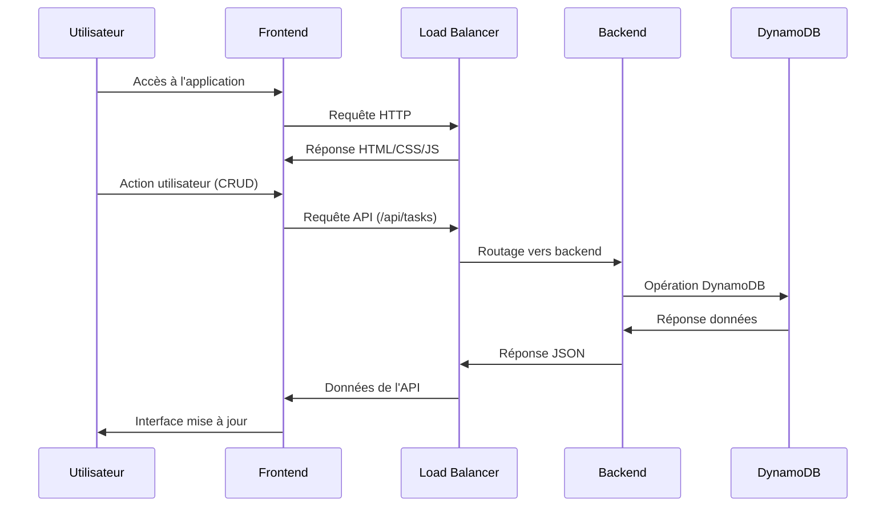

# Architecture du Projet Fil Rouge

## Diagramme d'Architecture AWS

## Flux de Données

## Composants de l'Infrastructure

### 1. Réseau (VPC)
- **VPC** : 10.0.0.0/16
- **Subnets publics** : 2 AZ pour haute disponibilité
- **Internet Gateway** : Accès internet
- **Security Groups** : Règles de pare-feu

### 2. Compute (ECS)
- **Cluster ECS** : todo-cluster
- **Services** :
  - Frontend : 2 tâches (HA)
  - Backend : 2 tâches (HA)
- **Load Balancer** : ALB pour la répartition de charge

### 3. Base de Données
- **DynamoDB** : table `todo-tasks`
- **Clé primaire** : id (String)
- **Provisioning** : 5 RCU / 5 WCU

### 4. Monitoring
- **CloudWatch Logs** : Logs centralisés
- **CloudWatch Metrics** : Métriques système et application

### 5. CI/CD
- **GitHub Actions** : Pipeline automatisé
- **ECR** : Registre de conteneurs privé
- **Terraform** : Gestion d'infrastructure

## Sécurité

### Réseau
- VPC isolé avec subnets privés
- Security Groups restrictifs
- HTTPS terminé au Load Balancer

### Conteneurs
- Images basées sur Alpine Linux
- Utilisateurs non-root
- Secrets gérés via AWS Secrets Manager

### IAM
- Rôles et politiques avec principe du moindre privilège
- Task Role pour l'accès DynamoDB
- Execution Role pour ECS

## Scalabilité

### Auto Scaling
- ECS Service Auto Scaling basé sur CPU/mémoire
- Application Load Balancer pour la distribution
- DynamoDB On-Demand pour l'élasticité

### Haute Disponibilité
- Déploiement multi-AZ
- Health checks et auto-recovery
- Rolling deployments sans interruption

## Monitoring et Observabilité

### Logs
- Application logs vers CloudWatch
- ALB access logs
- VPC Flow Logs (optionnel)

### Métriques
- Métriques système (CPU, mémoire, réseau)
- Métriques applicatives (requêtes, erreurs)
- Métriques DynamoDB (throttling, capacity)

### Alertes
- Alertes CloudWatch sur seuils critiques
- Notifications SNS (optionnel)

## Coûts

### Estimation mensuelle (région eu-west-3)
- **ECS Fargate** : ~$20-40 (2 services, 2 tâches chacun)
- **DynamoDB** : ~$5-10 (usage modéré)
- **ALB** : ~$20
- **CloudWatch** : ~$5
- **Total estimé** : $50-75/mois

### Optimisations possibles
- Utilisation de Reserved Instances
- Scaling automatique agressif
- Archivage des logs anciens
- Monitoring des coûts via Cost Explorer
